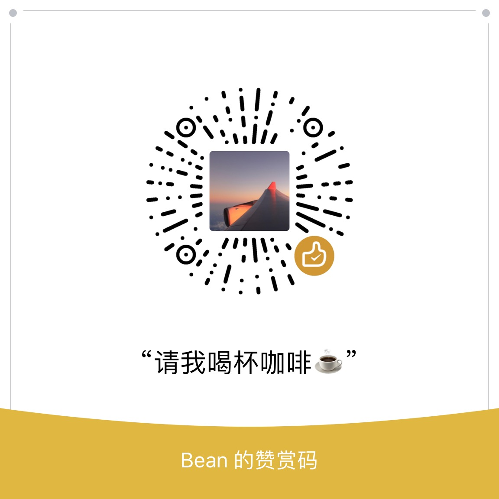

# GetWeixinCode

解决微信OAuth2.0网页授权只能设置一个回调域名的问题

## UPDATE

**最近发现微信公众号的网页授权域名已经支持配置多个，目前该项目的存在意义没有之前强烈了。目前唯一的用处就是多个域名可以统一在一个地方处理。**

## 使用方法

1. 部署`get-weixin-code.html`至你的微信授权回调域名的目录下

2. 使用方式类似于直接通过微信回调的方式，只是将回调地址改成了`get-weixin-code.html`所在的地址，另外省去了`response_type`参数（因为它只能为`code`）以及`#wechat_redirect`（它是固定的），它们会在`get-weixin-code.html`里面自己加上

3. `get-weixin-code.html`页面从微信那里拿到code之后会重新跳转回`redirect_uri`里面填写的url，并且在url后面带上`code`和`state`

## 详细示例

1. 前往微信公众平台->接口权限->网页授权获取用户基本信息->修改，填写授权回调页面域名，例如`www.abc.com`

2. 在`www.abc.com`域名下部署`get-weixin-code.html`，不一定是根目录，例如：`http://www.abc.com/xxx/get-weixin-code.html`

3. 假设你的`http://www.xyz.com/hello-world.html`这个页面需要获取微信授权，那么你应该使用以下地址来获取授权：`http://www.abc.com/xxx/get-weixin-code.html?appid=XXXX&scope=snsapi_base&state=hello-world&redirect_uri=http%3A%2F%2Fwww.xyz.com%2Fhello-world.html`

4. 这样最终就会跳转到这样一个地址：`http://www.xyz.com/hello-world.html?code=XXXXXXXXXXXXXXXXX&state=hello-world`，从而你就拿到了授权`code`以及自定义的`state`参数了

## Star走势图

## 特别感谢

感谢以下朋友为本项目提供的贡献（排名不分先后）

- [star769706697](https://github.com/star769706697)

- [davidqhr](https://github.com/davidqhr)

- [tianhe1986](https://github.com/tianhe1986)

- [AnthonyHuang001](https://github.com/AnthonyHuang001)

- [sanzhumu](https://github.com/sanzhumu)

- [q250305917](https://github.com/q250305917)

## 其他说明

- 通过多一次的跳转，解决了微信限制回调域名只能设置一个的问题

- 牺牲了一点用户体验，换来了项目部署的美感，不需要将各种项目都部署到一个域名下

- 如果你有这样的需求，可以使用本项目

- 欢迎提交pull request

- **建议先弄懂微信授权回调的流程再使用本项目**

- **很多朋友问我怎么支持第三方微信平台，这个需要对不同的第三方平台的授权方式有所了解，熟悉他们的授权方式，请求参数等。如果他们是通过在网站入口处的URL上进行授权的，那么可以使用本项目，将入口的URL改成上述的方式，如果他们是在流程中的某些页面去获取授权，那么是没法改变他们的获取地址的，所以本项目就不适用了**

## 支持作者

